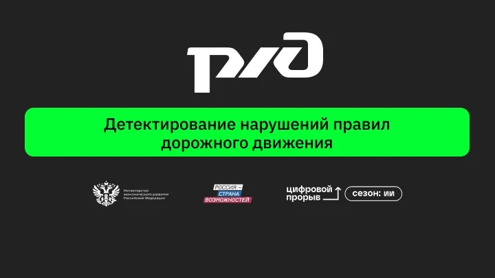
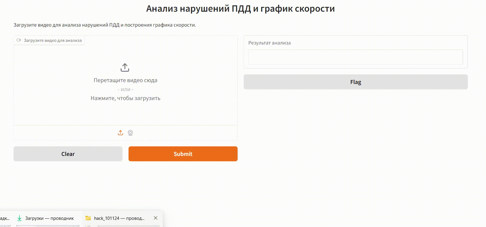
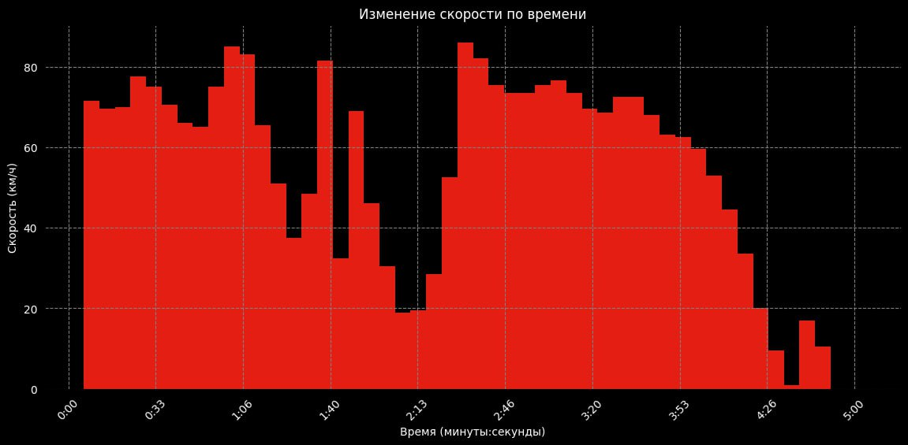
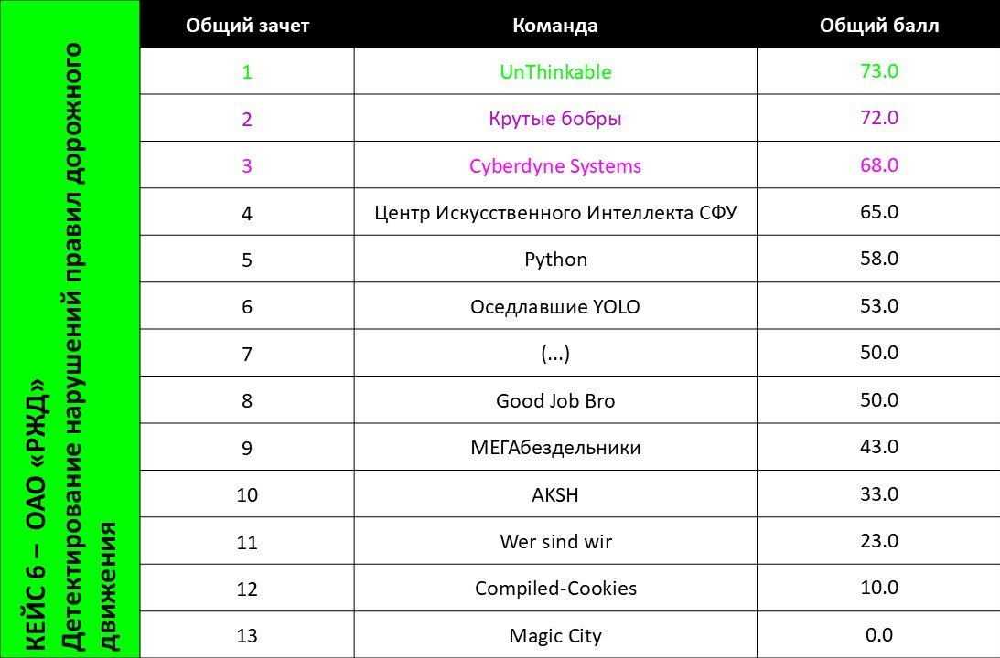

# 🚀 Хакатон: «Цифровой прорыв. Сезон: Искусственный интеллект» 🤖

# 📌 Кейс: Детектирование нарушений правил дорожного движения

## 🎯 Команда: Центр Искусственного Интеллекта СФУ 🧠

---

<table>
<tr>
<td align="left" width="50%">

### 🎯 Место: 4 
📍 **Международный хакатон 2024 года**  
🔗 [Ссылка на мероприятие](https://hacks-ai.ru/events/1077382)

### 📖 Описание кейса:
Разработка ИИ-прототипа для автоматического анализа видеозаписей с видеорегистраторов автотранспорта ОАО «РЖД» с целью выявления нарушений ПДД.

### 👥 Участники команды:
- [Константин Кожин](https://github.com/konstantinkozhin) — **Руководитель команды;** 
- [Павел Шерстнев](https://github.com/sherstpasha) — **Data Analyst;**  
- [Владислава Жуковская](https://github.com/vlada2025) — **Дизайнер;**  
- [Антон Михалев](https://github.com/asmikhalev) — **ML-инженер;**  
- [Алина Нуриманова](https://github.com/ALENKOZAVR) — **Data Scientist.**  

</td>
<td align="center" width="50%">

</td>
</tr>
</table>

## 📌 Описание решения  

### 🔹 Общая концепция  
Наша система анализирует видеозаписи с видеорегистраторов для выявления нарушений правил дорожного движения. В основе работы — комбинация моделей компьютерного зрения, которые определяют ключевые элементы дорожной сцены и фиксируют возможные нарушения. Такой подход делает систему гибкой, масштабируемой и позволяет её дообучать для повышения точности.  

### ⚙️ Схема работы системы  
🔹 **Разделение видео** на фрагменты по 10 секунд для последовательной обработки.  
🔹 **Детекция ключевых объектов** с помощью нейросетей:  
   - YOLOv5 — поиск автомобилей и пешеходов.  
   - YOLOv5 — обнаружение дорожных знаков и светофоров.  
   - SegFormer — сегментация дорожной разметки.  
🔹 **Фокусировка на значимых зонах**: фоновые элементы приглушаются, что повышает точность анализа.  
🔹 **Определение нарушений** с помощью XCLIP: модель анализирует обработанный фрагмент и фиксирует возможные нарушения.  
🔹 **Переход к следующему фрагменту** и повторение процесса.  

### 🔄 Гибкость и масштабируемость  
Мы разработали **модульную систему**, которая не зависит от жёстких правил и эвристик. Вместо простых триггеров (например, пересечение разметки) используется **нейросеть**, которую можно дообучать и адаптировать под новые типы нарушений. Это делает систему более точной и расширяемой.  

## 🎥 Screencast (Демонстрация решения)  
Посмотрите, как система выявляет нарушения на реальных видеозаписях.  

📌 **[Смотреть видеоролик](Screencast.mp4)**  

<table>
<tr>
<td align="center"><b>📹 Презентация работы системы</b></td>
<td align="center"><b>🎯 Обработанный фрагмент (вход для XCLIP)</b></td>
</tr>
<tr>
<td></td>
<td></td>
</tr>
</table>

## 📊 Дополнительный функционал: Распознавание скорости

В дополнение к выявлению нарушений, наша система использует **OCR-модель** для **распознавания показателей скорости** с видеорегистраторов. Это позволяет фиксировать еще одно важное нарушение — **превышение скорости**.

🔹 **Извлечение скорости** из видео в режиме реального времени.  
🔹 **Сравнение полученных данных** с допустимыми скоростными ограничениями.  
🔹 **Фиксация нарушений** при превышении установленного лимита.  
🔹 **Запись статистики** по каждому фрагменту видео для дальнейшего анализа.  

Этот модуль расширяет возможности системы, позволяя детектировать не только визуальные нарушения, но и **анализировать скорость транспортного средства**.

---

    

---

## 🛠 Технологический стек
- **Python** — основной язык разработки;  
- **PyTorch** — для построения и обучения нейросетей;  
- **Hugging Face** — для использования предобученных моделей (X-CLIP, AST, BERT);  
- **EasyOCR** — для распознавания текста на видеозаписях (скорость);  
- **Gradio** — для удобного развертывания и тестирования модели через веб-интерфейс;  
- **Docker** — для контейнеризации и развертывания системы.  

---

## 🏆 Лидерборд

  

## 📂 Описание файлов в репозитории

### 📌 Основные файлы проекта:

1. **`FULL_LAUNCH.ipynb`**  
   - Jupyter Notebook для полного запуска решения на тестовом датасете.  
   - Включает загрузку данных, обработку видео, предсказания и формирование `submission.csv`.  

2. **`best_model_dataset_1_39.pth`** и **`best_model_dataset_1_47.pth`**  
   - Файлы с весами предварительно обученных моделей.  
   - Используются при запуске ноутбука для выполнения предсказаний.  

3. **`dataset.py`**  
   - Определяет класс датасета и логику загрузки данных.  
   - Обеспечивает корректную обработку входных видеоданных.  

4. **`model.py`**  
   - Содержит архитектуру модели, используемой для анализа видео.  

5. **`train_run.py`**  
   - Скрипт для обучения модели, включая настройку, процесс обучения и сохранение контрольных точек.  

### 🔄 Полный запуск решения  
Файл **`FULL_LAUNCH.ipynb`** позволяет запустить всю последовательность обработки данных, включая:  
✅ Задание пути к папке с видео (`video_folder`).  
✅ Формирование выходного файла (`output_csv`).  
✅ Автоматическое создание `submission.csv` с результатами детекции нарушений. 
